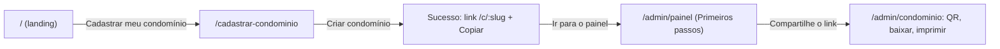
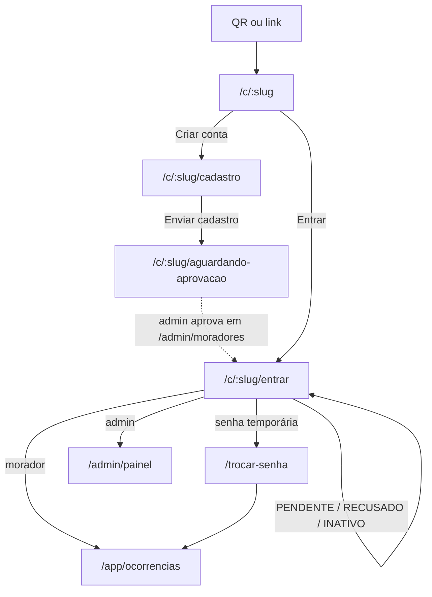
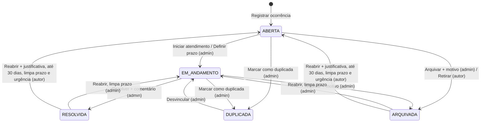

# Especificação de UI do MVP

> Issue #4 · responsável: `zidane` · implementação: `beckham` (issue #3 em diante)
>
> Fonte de produto e regras: [`docs/arquitetura-mvp.md`](../arquitetura-mvp.md). Este documento não muda regra de negócio; quando a UI precisa de algo que o plano não fixa, o ponto vai para a seção [Pendências](#12-pendências).
>
> Mockups: [`docs/ui/mockups/index.html`](mockups/index.html). Abra no navegador. Eles usam o Tailwind via Play CDN com classes no padrão Flowbite; o CSS e o JS do Flowbite não são carregados.
>
> Decisões já tomadas que este documento aplica: [ADR-006](../adr/006-flowbite-sem-initflowbite.md) (Flowbite sem `initFlowbite()`) e as regras de produto da seção [1.1](#11-regras-de-produto-aplicadas-pela-ui).

## Sumário

1. [Princípios e decisões](#1-princípios-e-decisões)
2. [Tokens](#2-tokens)
3. [Componentes: Flowbite e `shared/ui`](#3-componentes-flowbite-e-sharedui)
4. [Shells, navegação e breakpoints](#4-shells-navegação-e-breakpoints)
5. [Telas](#5-telas)
6. [Visibilidade por papel na UI](#6-visibilidade-por-papel-na-ui)
7. [Fluxos principais](#7-fluxos-principais)
8. [Microcopy](#8-microcopy)
9. [Acessibilidade](#9-acessibilidade)
10. [Para a implementação](#10-para-a-implementação)
11. [Mockups](#11-mockups)
12. [Pendências](#12-pendências)

---

## 1. Princípios e decisões

**Quem usa e onde.** O morador usa o celular, em pé, no elevador ou na garagem, muitas vezes com uma mão só. O síndico usa o celular no dia a dia e o computador para tratar a fila. Por isso, o projeto parte de 375px. O desktop é uma ampliação, não a referência.

**Princípios**

1. **Consequência antes da ação.** Se uma escolha muda quem vê o conteúdo (tipo Reclamação, anonimato, comentário público ou nota interna), a UI diz o efeito no momento da escolha, e não depois.
2. **Status é a informação principal de um card.** A cor fica reservada para status, urgência e alertas. O tipo usa só ícone e texto, em badge neutro.
3. **Uma ação primária por bloco.** O botão primário (fundo azul) indica o próximo passo. As demais ações são secundárias (contorno) ou texto.
4. **Nada depende só de cor.** Todo badge tem texto, toda urgência tem ícone de barras e todo erro tem ícone e mensagem.
5. **Todo dado remoto tem quatro estados:** carregando, vazio, erro e resultado parcial.

**Decisões de design**

| Decisão | Escolhido | Descartado e por quê |
|---|---|---|
| Cor primária | Azul `#1d4ed8` (Tailwind `blue-700`), igual ao padrão do Flowbite | Cor de marca própria: não há guia de marca. O azul padrão evita sobrescrever cada exemplo do Flowbite e é trocável pelo token `primaria` quando houver marca. |
| Fonte | Pilha do sistema (`font-sans` padrão do Tailwind) | Inter (sugerida pela doc do Flowbite): seria fonte nova, sem aprovação, e custa download no 4G. |
| Tema escuro | Fora do MVP. `color-scheme: light` | Dobraria a verificação de contraste. Os tokens são semânticos, então dá para adicionar o tema depois sem trocar classe nas telas. |
| Cor do tipo | Badge neutro com ícone | Uma cor por tipo: com 5 status, 4 urgências e 5 tipos, a paleta deixaria de ter significado. |
| Urgência | Quatro níveis (`BAIXA`, `MEDIA`, `ALTA`, `CRITICA`), com ícone de 1 a 4 barras, e "Não triada" com borda tracejada. Crítica é sólida | Escala numérica: menos legível. Só cor: reprova "cor nunca é o único portador". |
| Badges sólidos | Só dois: **Crítica** (`#7f1d1d`, 4 barras) e **Atrasada** (`#b91c1c`, relógio). Os dois se distinguem pelo ícone e pelo texto, nunca pela cor (contraste entre os dois fundos: 1.55) | Atrasada como único sólido: com 4 níveis, a Crítica precisa pesar mais que a Alta tintada. |
| Modais e drawers | `<dialog>` nativo com `showModal()`, estilizado com classes Flowbite ([ADR-006](../adr/006-flowbite-sem-initflowbite.md)) | Modal JS do Flowbite: não move o foco para dentro, não devolve o foco ao fechar e não prende o Tab. O `<dialog>` faz tudo isso nativamente e sem biblioteca. |
| Ícones | **Flowbite Icons**, em SVG inline, servidos por um componente `ui-icone` | Pacote de ícones via npm ou fonte de ícones: peso e uma dependência a mais. O sprite dos mockups é provisório. |
| QR code | Biblioteca **`qrcode`** (npm), gerada no cliente | Serviço externo de QR: vaza a URL do condomínio para terceiros e depende de rede. |
| Data do prazo | `<input type="date">` nativo | Datepicker do Flowbite: seletor nativo do celular é melhor no toque e no leitor de tela, e não exige JS. |
| Fila do admin no celular | Cards empilhados; tabela a partir de 768px | Tabela com rolagem horizontal em 375px: esconde colunas, e com isso a pessoa perde contexto. |
| Navegação do morador | Bottom-nav com 4 destinos (Condomínio, Minhas, Nova, Perfil) só nas telas raiz | Bottom-nav em todas as telas: no formulário, rouba espaço do teclado e um toque acidental descarta o rascunho. |
| Paginação | Botão "Carregar mais" (cursor) | Rolagem infinita: tira o rodapé do alcance, confunde o leitor de tela e não permite voltar ao ponto. |
| Senha | Botão "Mostrar senha" e nenhum campo de confirmação | Campo "Confirmar senha": dobra o esforço; mostrar a senha resolve o erro de digitação com menos atrito. |

### 1.1 Regras de produto aplicadas pela UI

Decididas na revisão do PR #28 (pelo usuário e pelo orquestrador). A UI só exibe o resultado: quem calcula é a API.

| # | Regra | Onde aparece |
|---|---|---|
| R1 | **Motivo de arquivamento e justificativa de reabertura seguem a visibilidade da ocorrência**, como um comentário público. A dica do modal é condicional e sugere nota interna para detalhes sensíveis | 5.11, 5.16, 8.7 |
| R2 | **"Atrasada"** = status ABERTA ou EM_ANDAMENTO **e** `prazo < hoje` no fuso do condomínio. A API calcula e envia `atrasada: boolean` no presenter; **a UI não calcula** | Cards, tabela, detalhe, painel |
| R3 | **"Não triada"** = `urgencia` nula **e** status ABERTA ou EM_ANDAMENTO. Painel e fila usam o mesmo recorte, então os números batem | 5.13, 5.14 |
| R4 | **Reabrir limpa o prazo**, seja pelo autor, seja pelo admin. A reabertura pelo autor também zera a urgência (volta para "Não triada") | 5.11, 5.16, 6.3, 6.4 |
| R5 | Triagem que **torna pública uma Reclamação** pede confirmação em `alertdialog`, com o aviso completo (todo o histórico público, inclusive o bloco no caso identificado e o motivo e a justificativa, se houver) | 5.16, 8.7 |
| R6 | O **subsíndico acessa Condomínio em modo leitura**: link, copiar, QR e cartaz, sem editar | 4.2, 5.13, 5.19 |
| R7 | A tela **Moradores lista só `papel=MORADOR`**. Admins aparecem apenas em Equipe | 5.17 |
| R8 | O texto do anonimato não faz promessa absoluta: "Seu nome fica oculto para os outros moradores e para a administração." | 5.10, 8.7 |
| R9 | Não há gênero no modelo: papéis aparecem como **"Síndico(a)"** e **"Subsíndico(a)"** | Sidebar, timeline, Equipe |

---

## 2. Tokens

Os tokens são **semânticos**: o nome diz o papel, não a cor. Os valores vêm da paleta padrão do Tailwind, para não criar cor nova. O código das telas usa **só** os nomes desta seção. Classe de cor crua (`bg-blue-700`, `text-gray-600`) fica restrita a `shared/ui`, e mesmo lá só quando o token não cobre o caso.

Os contrastes foram calculados pela fórmula de luminância relativa da WCAG 2.x. O piso é AA: 4.5:1 para texto normal e 3:1 para texto grande e para elementos de interface.

### 2.1 Cores base

| Token (classe) | Valor | Origem Tailwind | Uso | Contraste |
|---|---|---|---|---|
| `primaria` | `#1d4ed8` | blue-700 | Fundo do botão primário, links, item ativo da navegação | Branco sobre ela: **6.70**. Como texto sobre branco: **6.70**; sobre `superficie-app`: **6.41** |
| `primaria-hover` | `#1e40af` | blue-800 | Hover e pressionado do botão primário | Branco sobre ela: **8.72** |
| `primaria-foco` | `#2563eb` | blue-600 | Anel de foco (2px, com folga de 2px) e borda do campo em foco | Sobre branco: **5.17**; sobre `superficie-app`: **4.95** |
| `primaria-suave` | `#eff6ff` | blue-50 | Fundo do item selecionado (radio card, item ativo da sidebar) | `primaria` sobre ela: **6.16** |
| `texto` | `#111827` | gray-900 | Texto principal e fundo do chip ativo | Sobre branco: **17.74** |
| `texto-secundario` | `#4b5563` | gray-600 | Dicas, meta, rótulos do badge de tipo, ícones de ação | Sobre branco: **7.56**; sobre `superficie-sutil`: **6.87** |
| `texto-suave` | `#6b7280` | gray-500 | Data, número da ocorrência, placeholder | Sobre branco: **4.83**; sobre `superficie-app`: **4.63**. **Não usar sobre `superficie-sutil`** (4.39, reprova) |
| `superficie` | `#ffffff` | white | Cards, campos, barras, modais | — |
| `superficie-app` | `#f9fafb` | gray-50 | Fundo da página | — |
| `superficie-sutil` | `#f3f4f6` | gray-100 | Hover de botão neutro, prefixo de input, skeleton | — |
| `borda` | `#e5e7eb` | gray-200 | Borda **decorativa**: card, divisória, barra | Decorativa, isenta de contraste mínimo |
| `borda-controle` | `#6b7280` | gray-500 | Borda de **controle**: input, select, textarea, botão secundário, trilho do toggle desligado | Sobre branco: **4.83** (passa no 3:1). A borda `gray-300` padrão do Flowbite dá **1.47** e é proibida em controles. |

**Feedback**

| Token | Valores (fundo · texto · linha) | Uso | Contraste do texto |
|---|---|---|---|
| `perigo` | `perigo` `#b91c1c` · `perigo-hover` `#991b1b` · `perigo-suave` `#fef2f2` · `perigo-texto` `#991b1b` · `perigo-borda` `#dc2626` · `perigo-linha` `#fecaca` | Botão destrutivo, erro de campo, orientação de emergência, toast de erro | Branco sobre `perigo`: **6.47**; `perigo-texto` sobre `perigo-suave`: **7.60**; `perigo` sobre branco: **6.47**; `perigo-borda` sobre branco: **4.83** |
| `sucesso` | `sucesso-suave` `#f0fdf4` · `sucesso-texto` `#166534` · `sucesso-linha` `#bbf7d0` | Toast de sucesso, comentário de resolução | **6.81** |
| `info` | `info-suave` `#eff6ff` · `info-texto` `#1e40af` · `info-linha` `#bfdbfe` | Aviso de anonimato, aviso de duplicada | **8.01** |
| `aviso` | `aviso-suave` `#fff7ed` · `aviso-texto` `#9a3412` · `aviso-linha` `#fed7aa` | Conflito de versão, avisos que não são erro | **6.88** |

### 2.2 Cores semânticas do domínio

**Status da ocorrência** (badge com fundo tintado, ponto colorido decorativo e rótulo)

| Status | Rótulo | Fundo | Texto | Ponto | Contraste |
|---|---|---|---|---|---|
| `ABERTA` | Aberta | `status-aberta-fundo` `#dbeafe` | `status-aberta-texto` `#1e40af` | `#2563eb` | **7.15** |
| `EM_ANDAMENTO` | Em andamento | `status-andamento-fundo` `#fef9c3` | `status-andamento-texto` `#854d0e` | `#ca8a04` | **6.38** |
| `RESOLVIDA` | Resolvida | `status-resolvida-fundo` `#dcfce7` | `status-resolvida-texto` `#166534` | `#16a34a` | **6.49** |
| `ARQUIVADA` | Arquivada | `status-arquivada-fundo` `#f3f4f6` | `status-arquivada-texto` `#374151` | `#6b7280` | **9.37** |
| `DUPLICADA` | Duplicada | `status-duplicada-fundo` `#f3e8ff` | `status-duplicada-texto` `#6b21a8` | `#9333ea` | **7.39** |

**Tipo da ocorrência** (badge neutro: fundo `superficie`, borda `borda` decorativa, texto `texto-secundario` com **7.56** de contraste e ícone de 14px)

| Enum (issue #12) | Rótulo longo (formulário, filtro, select) | Rótulo curto (badge, chip) | Ícone | Visibilidade |
|---|---|---|---|---|
| `MANUTENCAO_AREA_COMUM` | Manutenção em área comum | Manutenção | chave inglesa | Todos os moradores ativos |
| `RECLAMACAO_BARULHO` | Reclamação | Reclamação | megafone | **Só o autor e a administração**. Leva também o marcador "Restrita" na fila, no detalhe do admin e em "Minhas" |
| `DUVIDA_REGRAS` | Dúvida | Dúvida | interrogação em círculo | Todos os moradores ativos |
| `SUGESTAO_MELHORIA` | Sugestão de melhoria | Sugestão | lâmpada | Todos os moradores ativos |
| `COMUNICADO_MUDANCA_OBRA` | Comunicado de mudança ou obra | Mudança ou obra | caixa | Todos os moradores ativos |

**Urgência** (só admin; ícone de 4 barras, preenchidas conforme o nível, e rótulo; o leitor de tela lê "Urgência alta")

| Enum | Rótulo | Fundo | Texto | Ícone | Contraste |
|---|---|---|---|---|---|
| `null` (ver R3) | Não triada | `superficie` com borda **tracejada** `borda-controle` | `texto-secundario` | sem ícone | **7.56** (texto); borda **4.83** |
| `BAIXA` | Baixa | `urgencia-baixa-fundo` `#f3f4f6` | `urgencia-baixa-texto` `#374151` | 1 de 4 barras | **9.37** |
| `MEDIA` | Média | `urgencia-media-fundo` `#ffedd5` | `urgencia-media-texto` `#9a3412` | 2 de 4 barras | **6.38** |
| `ALTA` | Alta | `urgencia-alta-fundo` `#fee2e2` | `urgencia-alta-texto` `#991b1b` | 3 de 4 barras | **6.80** |
| `CRITICA` | Crítica | **sólido** `urgencia-critica-fundo` `#7f1d1d` | `urgencia-critica-texto` `#ffffff` | 4 de 4 barras | **10.02**; o fundo sobre a página: **10.02** (branco) e **9.59** (`superficie-app`) |

**Marcadores**

| Marcador | Aparência | Contraste | Onde |
|---|---|---|---|
| Atrasada | Fundo **sólido** `atrasada-fundo` `#b91c1c`, texto branco e ícone de relógio. Divide o peso sólido só com "Crítica", da qual se distingue pelo ícone e pelo texto | **6.47** | Card, tabela e detalhe, para todos que veem o prazo, quando a API envia `atrasada: true` (R2) |
| Restrita | Badge neutro com cadeado | **7.56** | Reclamação: fila (card e tabela), detalhe do admin e "Minhas" |
| Anônima / Anônimo | Texto `texto-suave` com ícone de olho cortado, na linha de meta (não é badge) | **4.83** | Card, detalhe e timeline |
| Nota interna | Card `interna-fundo` `#fffbeb`, borda esquerda 4px `interna-borda` `#d97706`, rótulo "NOTA INTERNA" com cadeado em `interna-rotulo` `#92400e` e texto `interna-texto` `#78350f` | Rótulo **6.84**; texto **8.75**. Borda decorativa (o rótulo e o cadeado carregam a informação) | Timeline do admin |

### 2.3 Tipografia

Pilha do sistema: `ui-sans-serif, system-ui, sans-serif, "Apple Color Emoji", "Segoe UI Emoji"` (padrão `font-sans` do Tailwind). Números de contador e de tabela usam `tabular-nums`.

| Papel | Classe | Tamanho / altura de linha | Peso | Uso |
|---|---|---|---|---|
| Título de destaque | `text-3xl md:text-4xl` | 30/36 → 36/40 | 700 | Só na landing |
| Título da página (h1) | `text-xl md:text-2xl` | 20/28 → 24/32 | 700 | Uma vez por tela |
| Título de seção (h2) | `text-lg` | 18/28 | 600 | "Histórico", blocos do painel |
| Título de card ou modal | `text-base` | 16/24 | 600 | Título da ocorrência no card, título de modal |
| Corpo | `text-base` | 16/24 | 400 | Descrição, comentários e **todo campo de formulário** (16px evita o zoom automático do iOS) |
| Apoio | `text-sm` | 14/20 | 400 · 500 · 600 | Rótulo de campo (600), dica, meta, botão (600) |
| Sobretítulo | `text-sm uppercase tracking-wide` | 14/20 | 600 | Seções do painel de gestão ("TRIAGEM", "STATUS", "PRAZO") |
| Badge e rótulo da bottom-nav | `text-xs` | 12/20 | 500 · 600 | **Único uso permitido de 12px** |

### 2.4 Espaçamento e layout

A escala de 4px do Tailwind fica como está. Os tokens de layout abaixo são as combinações que as telas usam.

| Token | Valor | Classe | Uso |
|---|---|---|---|
| Margem lateral | 16px abaixo de 768px · 24px a partir de 768px · 32px no admin a partir de 1024px | `px-4 md:px-6 lg:px-8` | Conteúdo de todas as telas |
| Respiro de card | 16px (compacto: 12px) | `p-4` / `p-3` | Card, alerta, modal / radio card, bolha da timeline |
| Entre campos | 24px | `space-y-6` | Formulários |
| Rótulo → dica → campo | 2px → 8px | `mt-0.5` / `mt-2` | Dentro de um campo |
| Entre cards de lista | 12px | `space-y-3` | Feed, Minhas, fila |
| Entre seções | 32px | `mt-8` | Detalhe (descrição → histórico → comentário) |
| Barra superior | 56px | `h-14` | Todas as áreas abaixo de 1024px |
| Bottom-nav | 64px + `env(safe-area-inset-bottom)` | `h-barra-inferior` | Morador, telas raiz |
| Folga para a bottom-nav | 112px | `pb-28` | `main` das telas com bottom-nav |
| Largura de leitura | 672px | `max-w-conteudo` | Área do morador e área pública |
| Largura do admin | 1152px | `max-w-admin` | Conteúdo do admin |
| Sidebar do admin | 256px | `w-64` | A partir de 1024px |
| Coluna de gestão | 352px | `xl:grid-cols-[minmax(0,1fr)_22rem]` | Detalhe do admin a partir de 1280px |
| Alvo de toque | 44px | `min-h-toque`, `h-toque w-toque` | Todo controle interativo |

### 2.5 Raio, borda e elevação

| Token | Valor | Classe | Uso |
|---|---|---|---|
| `controle` | 8px | `rounded-controle` | Botão, input, select, textarea, radio card |
| `cartao` | 12px | `rounded-cartao` | Card, alerta, toast, modal no desktop |
| folha | 16px só no topo | `rounded-t-2xl` | Bottom sheet no celular |
| pílula | 9999px | `rounded-full` | Badge, chip de visão, toggle |

| Nível | Tratamento | Uso |
|---|---|---|
| 0 | Borda `borda`, sem sombra | Card, barra superior, bottom-nav, sidebar |
| 1 | `shadow-lg` | Toast, menu suspenso |
| 2 | `shadow-xl` com fundo `rgb(17 24 39 / .5)` | Modal, bottom sheet, drawer |

### 2.6 Movimento

| Token | Duração e curva | Uso |
|---|---|---|
| `rapido` | 150ms `ease-out` | Hover, foco, toggle, troca de cor |
| `medio` | 200ms `ease-out` na entrada e 150ms `ease-in` na saída | Modal (fade + escala de 0.98), bottom sheet e drawer (deslizamento) |
| skeleton | `animate-pulse` (2s) | Carregamento |

Com `prefers-reduced-motion: reduce`, nada desliza nem escala, o skeleton fica estático e as transições caem para ~0ms (regra global em `styles.css`, igual à de `mockups/assets/mockup.css`).

### 2.7 Mapeamento para o Tailwind

A issue #3 decide a versão. As duas formas abaixo geram **as mesmas classes**, e os mockups usam a forma v3 ([`mockups/assets/mockup.js`](mockups/assets/mockup.js)).

**Tailwind v4 (`@theme` em `apps/web/src/styles.css`)**, com Flowbite 3:

```css
@import "tailwindcss";
@plugin "flowbite/plugin";
@source "../node_modules/flowbite";

@theme {
  /* base */
  --color-primaria: #1d4ed8;  --color-primaria-hover: #1e40af;  --color-primaria-foco: #2563eb;
  --color-primaria-suave: #eff6ff;  --color-primaria-borda: #bfdbfe;
  --color-texto: #111827;  --color-texto-secundario: #4b5563;  --color-texto-suave: #6b7280;  --color-texto-inverso: #ffffff;
  --color-superficie: #ffffff;  --color-superficie-app: #f9fafb;  --color-superficie-sutil: #f3f4f6;
  --color-borda: #e5e7eb;  --color-borda-controle: #6b7280;
  /* feedback */
  --color-perigo: #b91c1c;  --color-perigo-hover: #991b1b;  --color-perigo-suave: #fef2f2;
  --color-perigo-texto: #991b1b;  --color-perigo-borda: #dc2626;  --color-perigo-linha: #fecaca;
  --color-sucesso-suave: #f0fdf4;  --color-sucesso-texto: #166534;  --color-sucesso-linha: #bbf7d0;
  --color-info-suave: #eff6ff;  --color-info-texto: #1e40af;  --color-info-linha: #bfdbfe;
  --color-aviso-suave: #fff7ed;  --color-aviso-texto: #9a3412;  --color-aviso-linha: #fed7aa;
  /* status */
  --color-status-aberta-fundo: #dbeafe;  --color-status-aberta-texto: #1e40af;  --color-status-aberta-ponto: #2563eb;
  --color-status-andamento-fundo: #fef9c3;  --color-status-andamento-texto: #854d0e;  --color-status-andamento-ponto: #ca8a04;
  --color-status-resolvida-fundo: #dcfce7;  --color-status-resolvida-texto: #166534;  --color-status-resolvida-ponto: #16a34a;
  --color-status-arquivada-fundo: #f3f4f6;  --color-status-arquivada-texto: #374151;  --color-status-arquivada-ponto: #6b7280;
  --color-status-duplicada-fundo: #f3e8ff;  --color-status-duplicada-texto: #6b21a8;  --color-status-duplicada-ponto: #9333ea;
  /* urgência e marcadores */
  --color-urgencia-baixa-fundo: #f3f4f6;  --color-urgencia-baixa-texto: #374151;
  --color-urgencia-media-fundo: #ffedd5;  --color-urgencia-media-texto: #9a3412;
  --color-urgencia-alta-fundo: #fee2e2;   --color-urgencia-alta-texto: #991b1b;
  --color-urgencia-critica-fundo: #7f1d1d;  --color-urgencia-critica-texto: #ffffff;
  --color-atrasada-fundo: #b91c1c;  --color-atrasada-texto: #ffffff;
  --color-interna-fundo: #fffbeb;  --color-interna-texto: #78350f;  --color-interna-rotulo: #92400e;  --color-interna-borda: #d97706;
  /* forma e medida */
  --radius-controle: 0.5rem;  --radius-cartao: 0.75rem;
  --spacing-toque: 2.75rem;  --spacing-barra-inferior: 4rem;
  --container-conteudo: 42rem;  --container-admin: 72rem;
  --default-transition-duration: 150ms;  --transition-duration-rapido: 150ms;  --transition-duration-medio: 200ms;
}
```

Se o tema padrão do Flowbite 3 for importado, aponte as variáveis de marca dele (família `--color-brand*`; confira os nomes na versão instalada) para `var(--color-primaria)` e seus pares. Assim, componentes copiados da documentação herdam a primária.

**Tailwind v3 (`tailwind.config.js`)**, com Flowbite 2: é o mesmo objeto de `theme.extend` de [`mockups/assets/mockup.js`](mockups/assets/mockup.js), mais `plugins: [require('flowbite/plugin')]` e `content: ['./src/**/*.{html,ts}', './node_modules/flowbite/**/*.js']`.

**Pares proibidos** (reprovam AA): `texto-suave` sobre `superficie-sutil`; qualquer `gray-300` ou `gray-400` como borda de controle ou trilho de toggle; texto branco sobre `primaria-foco`; `interna-borda` como texto. E uma regra de forma: Crítica e Atrasada nunca aparecem sem o ícone, porque a diferença de cor entre os dois fundos é 1.55:1.

---

## 3. Componentes: Flowbite e `shared/ui`

**Regra ([ADR-006](../adr/006-flowbite-sem-initflowbite.md), status Aceita):** as telas usam apenas componentes de `apps/web/src/app/shared/ui`. O Flowbite serve de **referência de marcação e classes** para esses componentes, e o Flowbite Icons fornece os ícones. O **comportamento** (abrir, fechar, foco, `aria-expanded`) fica no Angular, com signals. O `initFlowbite()` e o JS do Flowbite não são usados. Motivo: os componentes JS do Flowbite manipulam o DOM fora do ciclo do Angular, se perdem quando a rota troca e não gerenciam o foco como a WCAG exige.

Os nomes de seletor são sugestões. O prefixo `ui-` segue a pasta.

| Necessidade | Componente `shared/ui` | Base Flowbite | Variantes e entradas | Estados obrigatórios | Notas de acessibilidade |
|---|---|---|---|---|---|
| Ícone | `ui-icone` | Flowbite Icons (SVG inline, copiado para um registro em `shared/ui/icones`) | `nome`, `tamanho` (16, 20 ou 24px), `rotulo?` | — | Sem `rotulo`: `aria-hidden="true"`. Com `rotulo`: `role="img"` + `aria-label`. `stroke="currentColor"` para herdar a cor do texto. As barras de urgência (1 a 4) são um SVG próprio, porque o catálogo não tem um equivalente |
| Ação | `ui-botao` (também como `a[ui-botao]`) | Buttons | `primario` · `secundario` (contorno `borda-controle`) · `texto` · `perigo` (sólido) · `perigo-contorno`; `bloco` (largura total abaixo de 768px); `icone` (quadrado 44px, exige `rotulo`) | repouso, hover (`primaria-hover` / `superficie-sutil`), foco visível, ativo (= hover), desabilitado (`opacity-50`, `cursor-not-allowed`, `aria-disabled`), **carregando** (spinner + rótulo no gerúndio + `aria-busy`, sem clique duplo) | Altura mínima de 44px. Botão só com ícone exige `aria-label`. Não use `disabled` para esconder um erro de validação: deixe enviar e mostre o erro. |
| Campo de texto | `ui-campo` | Input field | `tipo` (text, tel, email, password com botão "Mostrar senha"), `rotulo`, `dica`, `erro`, `opcional`, `prefixo` ("#"), `mascara` (telefone) | repouso (borda `borda-controle`), foco (borda `primaria-foco` + anel 2px a 30%), **erro** (borda 2px `perigo-borda` + mensagem `perigo` com ícone), desabilitado (`superficie-sutil`), somente leitura | `<label for>` sempre visível (placeholder não é rótulo). `aria-describedby` = dica + erro. `aria-invalid="true"` no erro. Texto de 16px. |
| Texto longo | `ui-area-texto` | Textarea | `rotulo`, `dica`, `min`, `max`, `contador` | iguais aos do `ui-campo` + contador `n/max` (`tabular-nums`) | O contador não é `aria-live` a cada tecla. Ele anuncia só ao cruzar o mínimo e ao faltarem 100 para o máximo. |
| Escolha em lista | `ui-select` | Select (nativo) | `rotulo`, `opcoes`, `placeholder` (opção desabilitada) | como `ui-campo` | `<select>` nativo; nada de select customizado no MVP. |
| Tipo da ocorrência | `ui-opcoes-cartao` | Radio (variante "advanced") | `opcoes: {valor, rotulo, descricao, icone, aviso?}` | repouso, hover, **selecionado** (borda `primaria` + anel 1px + fundo `primaria-suave` + o próprio radio marcado), foco (anel global no radio), erro (mensagem abaixo da legenda) | `<fieldset>` + `<legend>`. Setas trocam a opção (comportamento nativo do radio). O card inteiro é o `<label>`. |
| Liga/desliga | `ui-alternador` | Toggle | `rotulo`, `dica` | desligado (trilho `borda-controle`), ligado (`primaria`), foco (anel no trilho), desabilitado | `<input type="checkbox" role="switch">`. Toda a linha (rótulo + trilho) é o alvo de 44px. |
| Data | `ui-campo` com `tipo="date"` | — (nativo) | `min` (hoje) | como `ui-campo` | Seletor nativo. Exibição sempre em `dd/mm/aaaa`. |
| Status | `ui-badge-status` | Badge (pill) | `status` | — (não interativo) | Texto sempre visível; o ponto é `aria-hidden`. |
| Tipo | `ui-badge-tipo` | Badge (com borda) | `tipo`, `curto` | — | Ícone `aria-hidden`. |
| Urgência | `ui-badge-urgencia` | Badge | `urgencia` (`null` = Não triada; `BAIXA` a `CRITICA`) | — | Prefixo "Urgência" em `sr-only`. **Nunca é renderizado na área do morador.** |
| Marcadores | `ui-marcador` | Badge | `atrasada` · `restrita` | — | — |
| Card de ocorrência | `ui-cartao-ocorrencia` | Card | `contexto: 'feed' \| 'minhas' \| 'admin'` controla quais campos aparecem (ver seção 6) | repouso, hover (borda `gray-300`), foco (anel no card inteiro via `:has(a:focus-visible)`) | O único link é o título (`<a>` com `::after` cobrindo o card); badges e meta não são focáveis. Lista em `<ul>`/`<li>`, card em `<article>`. |
| Tabela da fila | `ui-tabela` (só a fila no MVP) | Table | colunas fixas (5.15) | linha com hover; foco no link do título | `<caption class="sr-only">`, `<th scope="col">`. Nenhuma linha clicável com `onclick`: o link é o título. |
| Histórico | `ui-timeline` | Timeline (vertical) | `eventos` (catálogo em 6.3), `visao: 'morador' \| 'admin'` | vazio impossível (sempre há "registrou") | `<ol>` em ordem cronológica. Cada item tem `<time datetime>`. O ícone do evento é `aria-hidden`; o texto diz o que houve. |
| Comentar | `ui-comentario-form` | Textarea + Toggle | `permiteInterno` (admin) | ocioso, enviando, erro (mantém o texto); no admin, modo nota interna (card em tom `interna`) | No admin, o `ui-alternador` "Nota interna" (desligado = público, issue #18) troca a dica (`aria-live`) e o rótulo do botão. |
| Alerta inline | `ui-alerta` | Alert | `info` · `aviso` · `perigo` · `sucesso`; `titulo`; `acao?` | — | `role="alert"` só para erro que surge depois de uma ação; texto fixo (emergência, anonimato) é `<aside>`/`<p>` simples. |
| Toast | `ui-toast` + `ToastService` | Toast | `sucesso` · `erro` | entrando, visível, saindo | Região única `aria-live="polite"` (sucesso) e `role="alert"` (erro) no shell. Sucesso fecha em 5s, com pausa no hover e no foco; erro só fecha manualmente. O botão fechar tem 44px. |
| Modal / bottom sheet | `ui-modal` | Modal (só visual) | `titulo`, `tamanho`, `tipo: 'dialog' \| 'alertdialog'` | abrindo, aberto, enviando (botões desabilitados), erro (dentro do modal) | `<dialog>` + `showModal()`. Abaixo de 768px vira bottom sheet (`rounded-t-2xl`, alinhado à base). Foco inicial no primeiro campo, ou no botão **não destrutivo** em confirmações. Esc fecha. O foco volta ao botão que abriu. |
| Drawer | `ui-drawer` | Drawer | `lado: 'esquerda' \| 'base'` | — | Também `<dialog>`. Usado pelo menu do admin abaixo de 1024px e pelos filtros da fila abaixo de 768px. |
| Navegação do morador | `ui-bottom-nav` | Bottom Navigation | itens fixos | ativo (`primaria` + `aria-current="page"`), hover | `<nav aria-label="Navegação principal">`. Célula de 64px de altura. |
| Barra superior | `ui-barra-superior` | Navbar | `modo: 'raiz' \| 'empilhada'` | — | Na empilhada, o botão voltar tem `aria-label` específico ("Voltar para ocorrências"). |
| Sidebar do admin | `ui-sidebar` | Sidebar | itens por papel | ativo, hover, contador (pendentes) | O contador tem texto `sr-only` ("3 cadastros pendentes"). |
| Abas | `ui-abas` | Tabs (estilo sublinhado) | `abas: {rotulo, contador?, rota}` | ativa, hover, foco | São **links de rota** (`aria-current="page"`), não `role="tab"`: cada aba é uma URL (`?aba=pendentes`). Rolam na horizontal abaixo de 640px. |
| Visões rápidas | `ui-chips-visao` | Button Group / pills | `visoes: {rotulo, contador?, query}` | ativa (fundo `texto`, letra branca, **17.74**), inativa (contorno `borda-controle`) | Links com `aria-current="true"`. Rolagem horizontal com a última visível pela metade como pista. |
| Vazio | `ui-estado-vazio` | — | `icone`, `titulo`, `texto`, `acao?` | — | O título é um `<h2>`/`<h3>` conforme a tela. |
| Erro de carga | `ui-estado-erro` | Alert | `titulo`, `texto`, `tentarDeNovo()` | — | `role="alert"`. O botão "Tentar de novo" recebe o foco se o erro surgiu depois de uma ação. |
| Carregando | `ui-skeleton` | Skeleton | `forma: 'cartao' \| 'linha-tabela' \| 'detalhe'`, `quantidade` | — | Contêiner com `aria-busy="true"` + texto `sr-only` "Carregando…". Formas `aria-hidden`. |
| Paginação | `ui-carregar-mais` | Button | `carregando`, `fim` | ocioso, carregando, fim ("Isso é tudo."), erro (resultado parcial, 5.0) | Depois de carregar, o foco vai para o primeiro item novo. |
| Contador do painel | `ui-cartao-numero` | Card | `rotulo`, `valor`, `destino`, `tom` | repouso, hover, foco | O card inteiro é um link; o nome acessível é "Não triadas: 3". |
| Copiar | `ui-copiar` | Clipboard | `valor`, `rotulo` | ocioso, copiado ("Link copiado" por 2s) | O feedback é anunciado em `aria-live`. |
| QR code | `ui-qrcode` | — (biblioteca `qrcode`, no cliente) | `url`, `tamanho` (240px na tela) | gerando (skeleton quadrado), pronto, erro ("Não foi possível gerar o QR code." + o link continua disponível) | ``. A URL sempre aparece em texto ao lado. "Baixar PNG" usa a mesma geração em 1024px |

---

## 4. Shells, navegação e breakpoints

### 4.1 Breakpoints

São os padrões do Tailwind, e cada um se justifica pelo conteúdo.

| Faixa | Justificativa | O que muda |
|---|---|---|
| 320–767px | Uma coluna. Abaixo de ~720px a fila não cabe em tabela | Bottom-nav (morador), barra superior com menu (admin), cards na fila, modais como bottom sheet, botões de largura total |
| ≥ 768px (`md`) | A tabela da fila com 6 colunas pede ~720px; os 4 destinos do morador cabem na barra superior | Morador: a bottom-nav some e a navegação vai para a barra superior. Admin: tabela na fila, filtros inline. Modais centralizados (`max-w-lg`), botões com largura do conteúdo |
| ≥ 1024px (`lg`) | Sidebar de 256px + 768px de conteúdo mantém a tabela legível | Admin: sidebar fixa; a barra superior some |
| ≥ 1280px (`xl`) | 256 (sidebar) + ~600 (conteúdo) + 352 (gestão) + respiros | Detalhe do admin em 2 colunas; coluna "Autor" na tabela |

Largura mínima suportada: 320px, sem rolagem horizontal da página. Só a linha de chips rola por dentro.

### 4.2 Shells

| Shell | Abaixo de 768px | A partir de 768px |
|---|---|---|
| **Público** (`/`, `/cadastrar-condominio`, `/c/:slug/*`, `/trocar-senha`) | Barra de 56px com o nome do produto ou do condomínio; conteúdo em `max-w-conteudo` | Igual, centralizado. Formulários em card branco com `max-w-md` |
| **Morador** (`/app/*`) | **Telas raiz** (Condomínio, Minhas, Perfil): barra com o nome do condomínio e bottom-nav. **Telas empilhadas** (Nova, Detalhe): barra com voltar ou fechar e o título, sem bottom-nav | Barra superior com o nome do condomínio, links Condomínio · Minhas · Perfil e botão primário "Nova ocorrência". Nas empilhadas, o link "← Minhas ocorrências" ou "← Condomínio" fica acima do h1 |
| **Admin** (`/admin/*`) | Barra com menu (drawer à esquerda) e o nome do condomínio. Nas empilhadas, o voltar no lugar do menu | ≥ 1024px: sidebar fixa com o condomínio, os itens, a pessoa logada ("Ana Lima · Síndico(a)") e "Sair" |

**Itens da sidebar por papel:** Painel · Ocorrências · Moradores (com contador de pendentes) · Equipe\* · Condomínio\*\*.

- \*Só o síndico vê Equipe. Para o subsíndico, o item não existe (não fica desabilitado) e o acesso direto a `/admin/equipe` é bloqueado.
- \*\*Os dois veem Condomínio. O subsíndico entra em **modo leitura** (R6): link, copiar, QR e cartaz, sem o formulário de dados.
- A pessoa logada aparece como "Ana Lima · Síndico(a)" (R9).

**Na troca de rota:** o `document.title` vira `"{Título da tela} · {Condomínio}"`, o foco vai para o `h1` (`tabindex="-1"`) e a rolagem volta ao topo, exceto no "voltar" para uma lista, que restaura a posição.

---

## 5. Telas

Convenção de cada tela: **objetivo**, **conteúdo em ordem de leitura** (é também a ordem do DOM e do foco), **ações**, **estados** e **375px vs. desktop**. Os estados comuns estão em 5.0, e cada tela só registra o que difere deles.

### 5.0 Estados padrão (valem para toda tela com dado remoto)

| Estado | Comportamento | Mockup |
|---|---|---|
| Carregando (primeira carga) | Skeleton na forma do conteúdo. Até 300ms não mostra nada, para evitar o piscar. Se passar de 10s, mantém o skeleton e acrescenta o texto "Está demorando mais que o normal…" | `estados.html` #1 |
| Vazio | `ui-estado-vazio` com ícone, título que diz o que falta e próxima ação | #2, #3 |
| Erro (nada carregou) | `ui-estado-erro` com "Tentar de novo". Para 404 e 403, ver 5.21 | #4 |
| Resultado parcial | Mantém os itens já carregados e mostra o erro inline no lugar do "Carregar mais", com "Tentar de novo" | #5 |
| Ação enviando | O botão da ação fica em "carregando"; os demais controles do bloco ficam desabilitados | #6 |
| Ação com erro | Erro de validação (422): no campo. Outros: toast de erro e o formulário mantém o que foi digitado | #6, #7 |
| Conflito (409, versão) | Alerta `aviso` no topo do bloco com "Recarregar ocorrência". Nada é sobrescrito sem aviso | #8 |

### 5.1 Landing `/`

- **Objetivo:** explicar o produto ao síndico e levar ao cadastro do condomínio; levar quem já usa ao login.
- **Conteúdo:**
  1. Título de destaque: "Ocorrências do condomínio, organizadas".
  2. Subtítulo em uma frase: os moradores registram pelo celular e o síndico acompanha tudo num só lugar.
  3. Botão primário "Cadastrar meu condomínio".
  4. Três blocos curtos: "Moradores registram em 1 minuto", "Reclamações ficam restritas à administração" e "Prazos e histórico em cada ocorrência".
  5. Bloco "Já usa?": campo "Endereço do seu condomínio" com prefixo `…/c/` e botão "Ir para o login" (leva a `/c/:slug/entrar`).
- **Estados:** endereço inexistente → erro no campo "Não encontramos esse condomínio. Confira o endereço com a administração."
- **375 vs. desktop:** uma coluna; a partir de 768px, os três blocos ficam em 3 colunas.

### 5.2 Cadastro do condomínio `/cadastrar-condominio` e sucesso

- **Objetivo:** o síndico cria o condomínio e a própria conta.
- **Conteúdo:** h1 "Cadastre seu condomínio". Fieldset "Condomínio": Nome do condomínio, Endereço do link (slug). Fieldset "Seus dados (síndico)": Nome, Telefone, E-mail (opcional), Senha (issue #5; o síndico não informa bloco nem apartamento). Por último, o aceite "Li e aceito os [termos de uso] e a [política de privacidade]" (checkbox obrigatório; as páginas chegam com a issue #25).
- **Slug:**
  - é preenchido a partir do nome (minúsculas, sem acento, hífen) até a pessoa editar;
  - mostra uma prévia "`seudominio/c/jardim-das-flores`";
  - a disponibilidade é verificada com debounce de 400ms por `GET /public/condominios/:slug`, sem endpoint novo: **404 = disponível**, 200 = em uso. Enquanto verifica, o campo mostra "Verificando…". O resultado aparece abaixo do campo ("Disponível", com ícone de check, em `sucesso-texto`; ou "Endereço já em uso. Tente outro.");
  - a verificação é só uma ajuda: o 409 no envio continua sendo a fonte da verdade;
  - regras: 3 a 40 caracteres, `a-z`, `0-9` e `-`.
- **Ações:** "Criar condomínio" (primário, bloco).
- **Sucesso** (mesma rota, outro estado, foco no h1):
  - h1 "Condomínio criado";
  - card com o link `/c/:slug`, `ui-copiar` "Copiar link" e o texto "Envie este link aos moradores ou imprima o QR code na tela Condomínio";
  - botão "Ir para o painel".
- **Erros:** 409 de slug → no campo do slug; 409 de telefone → no campo do telefone.

### 5.3 Página do condomínio `/c/:slug`

- **Conteúdo:**
  1. Nome do condomínio (h1).
  2. "Registre e acompanhe as ocorrências do condomínio pelo celular."
  3. Botão primário "Criar conta" (issue #7).
  4. Botão secundário "Entrar".
  5. Texto pequeno: "Seu cadastro precisa ser aprovado pela administração."
- **Estados:** slug inexistente → página "Condomínio não encontrado", com "Confira o link com a administração do seu condomínio." e um link para a landing. Condomínio inativo → mesma mensagem (não revela o status).

### 5.4 Cadastro do morador `/c/:slug/cadastro`

- **Conteúdo:** h1 "Criar conta" e subtítulo com o nome do condomínio. Campos:
  - Nome completo;
  - Telefone (celular): máscara `(11) 91234-5678`, `inputmode="tel"`, `autocomplete="tel-national"`;
  - Bloco e Apartamento, lado a lado mesmo em 375px (2 colunas de 50%);
  - E-mail (opcional), com a dica "Só para contato da administração.";
  - Senha: com "Mostrar senha" e a dica "Mínimo de 8 caracteres.";
  - aceite dos termos e da política de privacidade, como em 5.2 (issue #25).
- **Ação:** "Enviar cadastro".
- **Erro 409 de telefone:** no campo: "Este telefone já tem cadastro neste condomínio. [Entrar]".
- **Sucesso:** vai para `/c/:slug/aguardando-aprovacao`.

### 5.5 Login `/c/:slug/entrar`

- **Conteúdo:** h1 "Entrar", nome do condomínio, Telefone, Senha (com "Mostrar senha") e "Entrar" (primário, bloco). Abaixo:
  - "Esqueceu a senha? Peça à administração do condomínio para redefinir." (texto, não é link: não existe reset por conta própria);
  - "Ainda não tem cadastro? Criar conta".
- **Erros** (num `ui-alerta perigo` acima do formulário, com foco movido para ele). A mensagem de credencial é genérica e não revela se o telefone existe (issue #6). As mensagens de status só aparecem quando a senha está correta:

| Situação | Mensagem |
|---|---|
| Credenciais inválidas | "Telefone ou senha inválidos." |
| PENDENTE | "Seu cadastro ainda aguarda aprovação da administração." |
| RECUSADO | "Seu cadastro não foi aprovado. Fale com a administração do condomínio." |
| INATIVO | "Seu acesso está desativado. Fale com a administração do condomínio." |
| 429 | "Muitas tentativas. Aguarde {n} minutos e tente de novo." (n vem do `Retry-After`; sem ele, "Aguarde alguns minutos…") |

- **Sucesso:** com senha temporária vai para `/trocar-senha`; senão, morador vai para `/app/ocorrencias` e admin para `/admin/painel`. Com `?voltar=` válido (rota interna), volta para ela.

### 5.6 Aguardando aprovação `/c/:slug/aguardando-aprovacao`

Ícone de relógio, h1 "Cadastro enviado", o texto "A administração do {condomínio} precisa aprovar seu acesso. Depois disso, entre com seu telefone e senha." e o botão "Ir para o login". Não há polling.

### 5.7 Trocar senha `/trocar-senha`

- **Modo obrigatório** (depois de login com senha temporária):
  - h1 "Crie sua nova senha" e o texto "Você entrou com uma senha temporária. Para continuar, crie uma senha só sua.";
  - campos: Nova senha (com "Mostrar senha");
  - ação: "Salvar e continuar";
  - não há navegação para outras áreas; existe só "Sair".
- **Troca voluntária:** não usa esta rota. Fica no próprio Perfil (5.12, issue #9), com os campos "Senha atual" e "Nova senha".
- **Erros:**
  - senha igual à temporária → "Escolha uma senha diferente da temporária.";
  - curta → "A senha precisa ter pelo menos 8 caracteres.".

### 5.8 Feed do condomínio `/app/ocorrencias` (morador) · mockup [`feed.html`](mockups/feed.html)

- **Objetivo:** ver o que está acontecendo no condomínio e evitar registrar de novo o que já foi registrado.
- **Conteúdo:**
  1. h1 "Ocorrências do condomínio".
  2. Linha de apoio: "Ocorrências públicas dos moradores. Reclamações ficam visíveis só para quem registrou e para a administração."
  3. **Chips de filtro por tipo** (`ui-chips-visao`, issue #14): Todos · Manutenção · Dúvida · Sugestão · Mudança ou obra. Reclamação não entra, porque nunca aparece no feed. Escolha única, refletida na URL (`?tipo=DUVIDA_REGRAS`).
  4. Lista de `ui-cartao-ocorrencia contexto="feed"`, das mais recentes para as mais antigas.
  5. "Carregar mais".
- **Card (ordem):**
  - linha de badges: status, Atrasada (se houver) e tipo curto, com o número `#61` alinhado à direita;
  - título (link, até 2 linhas);
  - trecho da descrição (até 2 linhas, `text-sm`);
  - meta: autor (seção 6.1) · tempo relativo · "Prazo dd/mm" (se houver).
  - Nas próprias ocorrências (`minha: true`), a meta começa com "Sua".
- **Estados:**
  - vazio: "Nenhuma ocorrência pública ainda", com o texto "Dúvidas, sugestões, manutenções e comunicados de obra registrados pelos moradores aparecem aqui." e o botão "Registrar ocorrência";
  - vazio com filtro de tipo: "Nenhuma ocorrência deste tipo." com "Ver todas";
  - erro: "Não foi possível carregar as ocorrências.".
- **375 vs. desktop:** igual, em coluna de 672px; a partir de 768px a navegação vai para a barra superior.

### 5.9 Minhas ocorrências `/app/minhas`

- **Conteúdo:** h1 "Minhas ocorrências" e lista com `contexto="minhas"`. É o mesmo card do feed, com duas diferenças:
  - a meta mostra "Você (anônimo)", com o ícone de olho cortado, quando for o caso (issue #13);
  - Reclamação ganha o marcador "Restrita".
- Inclui todas as próprias: reclamações, anônimas e encerradas.
- Sem destaque de item novo: depois de registrar, a pessoa vai para o detalhe (5.10, issue #12), não para esta lista.
- **Vazio:** "Você ainda não registrou ocorrências", com "Quando algo precisar de atenção no condomínio, registre por aqui." e "Registrar ocorrência".

### 5.10 Nova ocorrência `/app/nova` (morador) · mockup [`nova-ocorrencia.html`](mockups/nova-ocorrencia.html)

- **Objetivo:** registrar em ~1 minuto, sabendo quem vai ver.
- **Barra (375px):** botão fechar (X, `aria-label="Cancelar e voltar"`) + "Nova ocorrência". Sem bottom-nav.
- **Conteúdo, em ordem:**
  1. **Orientação de emergência** (fixa, não fecha, sempre no topo): título "Risco imediato?", o texto "Fogo, vazamento de gás, alagamento ou pessoa ferida: acione a portaria ou ligue 193 (Bombeiros). Este canal não tem atendimento em tempo real." e o botão-link `tel:193` "Ligar para 193", com 44px. Usa o tom `perigo` suave.
  2. "Todos os campos são obrigatórios, exceto os marcados como opcionais."
  3. **Tipo da ocorrência:** `ui-opcoes-cartao` com 5 opções. Cada uma tem ícone, rótulo longo e descrição de uma linha (seção 8.2). A opção Reclamação traz também a linha com cadeado "Visível só para você e para a administração".
     - Abaixo do grupo, um texto dinâmico (`aria-live="polite"`) diz a visibilidade da escolha atual: "Todos os moradores do condomínio vão ver esta ocorrência." ou "Só você e a administração vão ver esta ocorrência. Ela não aparece no feed do condomínio.".
     - Nada vem pré-selecionado.
  4. **Título:** com a dica "Resuma em poucas palavras."; de 5 a 100 caracteres.
  5. **Descrição:** com a dica "Conte o que aconteceu, quando e onde. Mínimo de 20 caracteres."; contador `n/2000`.
  6. **Local (opcional):** com a dica "Ex.: garagem G2, hall do bloco B, salão de festas."
  7. **Anonimato:** card com `ui-alternador` "Registrar anonimamente" (issue #12) e a dica "Seu nome fica oculto para os outros moradores e para a administração." (R8). Ligado, abre logo abaixo um `ui-alerta info` com "**Seu nome não aparece.** Evite se identificar no texto: não cite seu nome, seu apartamento ou detalhes que revelem quem você é."
  8. Ações: "Registrar ocorrência" (primário, bloco) e "Cancelar" (texto).
- **Validação:** ao sair do campo (depois do primeiro toque) e no envio. No envio com erro, o foco vai para o primeiro campo inválido. As mensagens estão em 8.4.
- **Enviando:** "Registrando…". **Sucesso:** vai para o detalhe da ocorrência criada (`/app/ocorrencias/:id`, issue #12), com o toast "Ocorrência #63 registrada." e o foco no h1.
- **Descartar:** fechar ou voltar com algum campo preenchido abre o `alertdialog` "Descartar ocorrência?", com "O que você escreveu será perdido." e os botões "Continuar escrevendo" (foco inicial) e "Descartar".
- **375 vs. desktop:** a partir de 768px, o h1 aparece no conteúdo, o formulário fica em 672px e os botões ficam à direita com largura do conteúdo.

### 5.11 Detalhe da ocorrência `/app/ocorrencias/:id` (morador) · mockup [`detalhe-morador.html`](mockups/detalhe-morador.html)

- **Barra (375px):** voltar + "Ocorrência #57".
- **Conteúdo:**
  1. Badges: status, Atrasada e tipo (+ "Restrita" se for Reclamação e a pessoa for o autor).
  2. h1 com o título.
  3. Lista de definições:
     - "Registrada por" (seção 6.1);
     - "Criada em";
     - "Local" (se houver);
     - "Prazo" (se houver; em `perigo` com o marcador "Atrasada" quando `atrasada: true`);
     - "Resolvida em" ou "Arquivada em" (se encerrada).
  4. **Aviso de duplicada** (se DUPLICADA), em `ui-alerta info`: "Esta ocorrência foi marcada como duplicada da **#48 · Em andamento**. O acompanhamento continua por lá." O #48 é link quando a principal é visível para quem está vendo. Quando é restrita, aparece só o número e o status, sem link, e o texto termina com "Os detalhes dela não são públicos.".
  5. Descrição, em card, preservando as quebras de linha.
  6. **Bloco de ação do autor** (só quando `minha: true`):
     - ABERTA: link-botão "Retirar ocorrência" (`perigo-contorno`), que abre um `alertdialog` (`estados.html` #11).
     - RESOLVIDA/ARQUIVADA dentro de 30 dias: card "O problema continua?", com "Você pode reabrir até dd/mm/aaaa. A ocorrência volta para Aberta, sem prazo, e passa por nova análise da administração." (R4) e o botão "Reabrir ocorrência".
     - O botão abre o modal com a justificativa obrigatória (#10). A dica da justificativa segue a visibilidade (R1, textos em 8.7): "A administração e os moradores do condomínio veem esta justificativa." ou "Hoje, só você e a administração veem esta justificativa. Se a ocorrência ficar pública, ela também aparece."
     - Depois de 30 dias: no lugar do botão, "Prazo para reabrir encerrado em dd/mm/aaaa. Se o problema voltou, registre uma nova ocorrência." (com link; issue #20).
     - EM_ANDAMENTO e DUPLICADA: nada.
  7. **Histórico** (`ui-timeline visao="morador"`).
  8. **Comentar** (só o autor):
     - textarea com a dica de visibilidade: "A administração e os moradores do condomínio podem ler seu comentário." quando é pública; "Só a administração lê seu comentário." quando é Reclamação;
     - botão "Enviar comentário".
     - Quem não é o autor vê, no lugar, o texto "Só quem registrou e a administração podem comentar nesta ocorrência."
- **Estados:**
  - 404, ou ocorrência que deixou de ser visível (tipo corrigido para Reclamação): página "Ocorrência não encontrada", com "Ela pode ter sido removida da visualização pública." e "Voltar para o condomínio";
  - comentário enviando: o botão fica em "Enviando…" e, no sucesso, o comentário entra no fim da timeline e o campo é limpo.
- **375 vs. desktop:** igual, em 672px; o link "← Minhas ocorrências" fica acima dos badges.

### 5.12 Perfil `/app/perfil`

- **Conteúdo:**
  - h1 "Perfil";
  - card com os dados somente leitura: Nome, Telefone, Bloco e apartamento, E-mail;
  - o texto "Para alterar seus dados, fale com a administração.";
  - seção "Senha" com o botão secundário "Trocar senha" (issue #9). Ele expande, na própria página, os campos "Senha atual" e "Nova senha" (com "Mostrar senha"), mais "Salvar nova senha" e "Cancelar". O foco vai para "Senha atual". No sucesso, o toast "Senha alterada." aparece e a seção recolhe;
  - botão texto "Sair", com confirmação.
- A exclusão de conta fica para a issue #25: o lugar reservado é o fim da página, com o botão `perigo-contorno` "Excluir minha conta" e confirmação dupla.
  - 1ª confirmação: `alertdialog` "Excluir sua conta?", com "Seus dados pessoais serão apagados. As ocorrências continuam, como 'autor removido'.".
  - 2ª confirmação: digitar "EXCLUIR" para habilitar o botão final.

### 5.13 Painel `/admin/painel`

- **Conteúdo:** h1 "Painel" e uma grade de `ui-cartao-numero` (issue #22). Cada card é um link para a fila já filtrada, com **o mesmo recorte** que a fila usa, para os números baterem:
  - Abertas (status ABERTA);
  - Em andamento (status EM_ANDAMENTO);
  - Não triadas (R3);
  - Atrasadas (R2; tom `perigo` quando > 0);
  - Urgência: Crítica, Alta, Média e Baixa (só ABERTA e EM_ANDAMENTO). Crítica ganha tom sólido quando > 0;
  - Cadastros pendentes (link para Moradores › Pendentes).
- **Condomínio novo (todos os contadores em 0 e nenhum morador):** substitui a grade por "Primeiros passos", com 3 itens:
  1. Compartilhe o link ou o QR code (link para Condomínio; vale para síndico e subsíndico, R6);
  2. Aprove os cadastros;
  3. Convide um subsíndico (opcional; só síndico).
- **375 vs. desktop:** 2 colunas → 4 colunas a partir de 1024px.

### 5.14 Fila de ocorrências `/admin/ocorrencias` · mockup [`fila-admin.html`](mockups/fila-admin.html)

- **Objetivo:** achar o que precisa de ação agora.
- **Conteúdo:**
  1. h1 "Ocorrências" + botão primário "Nova ocorrência" ("Nova" abaixo de 640px).
  2. **Visões rápidas** (`ui-chips-visao`), com contadores: **Em aberto** (padrão: ABERTA + EM_ANDAMENTO) · Não triadas (R3) · Atrasadas (R2) · Encerradas (RESOLVIDA, ARQUIVADA, DUPLICADA) · Todas.
  3. **Filtros e ordenação** (issue #15):
     - Status: Aberta, Em andamento, Resolvida, Arquivada, Duplicada;
     - Tipo;
     - Urgência: Não triada, Crítica, Alta, Média, Baixa;
     - Origem: Todas, Moradores, Administração;
     - Ordenar por: "Mais recentes" (padrão) ou "Urgência" (Crítica → Baixa, e "Não triada" no fim; empate pela mais recente).
     - Abaixo de 768px: botão "Filtros" (com "(n)" quando houver filtro ativo) que abre um bottom sheet (drawer da base) com "Limpar" e "Ver resultados".
     - A partir de 768px: selects inline que aplicam na hora.
     - O total ("12 ocorrências") fica em `aria-live="polite"`.
  4. **Lista:**
     - abaixo de 768px, cards `contexto="admin"`: número, status, urgência ou "Não triada", Atrasada, Restrita / título / tipo · autor · tempo ou prazo;
     - a partir de 768px, tabela com as colunas Nº · Ocorrência (título-link + tipo + "Restrita") · Status · Urgência · Prazo (data; `perigo` + Atrasada quando `atrasada: true`) · Autor (a partir de 1280px) · Criada.
     - O autor aparece sempre no formato único do admin: "Nome · Bloco B, apto 302", "Anônimo" ou "Administração" (6.1).
  5. "Carregar mais".
- **URL:** visão, filtros e ordenação vivem na query (`?visao=nao-triadas&tipo=RECLAMACAO_BARULHO&ordem=urgencia`), para que voltar do detalhe e o link do painel caiam na mesma lista.
- **Estados:**
  - vazio sem filtro e sem nenhuma ocorrência: "Nenhuma ocorrência registrada ainda", com "Compartilhe o link do condomínio para os moradores começarem a registrar." e "Ver link e QR code" (síndico e subsíndico, R6);
  - vazio com filtro: "Nenhuma ocorrência com esses filtros", com o resumo dos filtros e "Limpar filtros";
  - visão "Não triadas" vazia: "Tudo triado. Nenhuma ocorrência esperando urgência.".

### 5.15 Nova ocorrência (admin) `/admin/ocorrencias/nova`

O mesmo formulário de 5.10, com estas diferenças:

- sem anonimato (o campo não existe, issue #16);
- sem orientação de emergência;
- texto no topo: "A ocorrência fica registrada como da administração. Para os moradores, o autor aparece como 'Administração'.";
- campo **"Urgência (opcional)"** (select: Crítica, Alta, Média, Baixa), com a dica "Se não escolher, a ocorrência fica como Não triada.";
- o texto dinâmico de visibilidade abaixo do tipo é escrito para o admin:
  - tipos públicos: "Todos os moradores ativos vão ver esta ocorrência no feed, com autor 'Administração'.";
  - Reclamação: "Fica restrita à administração: nenhum morador vê esta ocorrência.";
- o sucesso vai para o detalhe admin da nova ocorrência, com toast.

### 5.16 Detalhe da ocorrência `/admin/ocorrencias/:id` · mockup [`detalhe-admin.html`](mockups/detalhe-admin.html)

- **Conteúdo, na ordem do DOM:**
  1. Badges: status, urgência (ou Não triada), Atrasada, tipo e Restrita.
  2. h1.
  3. Lista de definições:
     - Autor: "Nome · Bloco B, apto 302" (formato único do admin, 6.1), com o telefone em link `tel:` numa linha própria; "Anônimo" com ícone; "Administração"; ou "Autor removido";
     - Criada em;
     - Local;
     - Prazo;
     - "Visível para": "Todos os moradores" ou "Autor e administração";
     - "Tipo escolhido pelo morador", quando o confirmado difere.
  4. Descrição.
  5. **Gestão**.
  6. **Duplicadas vinculadas** (só quando esta é a principal; issue #21): lista "#63 · Aberta · Título", com link para cada uma.
  7. Histórico (`visao="admin"`, com notas internas).
  8. Comentar.
- **Layout:** a Gestão existe **uma única vez no DOM**, sempre depois da descrição. Essa é a ordem de leitura e de foco da seção 9.
  - Abaixo de 1280px: uma coluna, na ordem acima.
  - A partir de 1280px: grid `grid-cols-[minmax(0,1fr)_22rem]` com `grid-rows-[auto_auto_auto_auto_auto_1fr]`. A Gestão vai para a coluna 2 ocupando todas as linhas (`row-start-1 row-end-[-1]`, `sticky top-6`, `self-start`); os outros blocos ficam na coluna 1, em linhas explícitas. A última linha `1fr` absorve a altura da Gestão, para não abrir espaço entre os blocos da coluna 1.
  - Nada é duplicado nem reordenado com `order`.
- **Gestão:** card com 3 seções.
  - **Triagem:**
    - "Urgência" (select: Crítica, Alta, Média, Baixa; placeholder desabilitado "Escolha a urgência" enquanto não triada), com a dica "O morador não vê a urgência.";
    - "Tipo" (select, com os 5 tipos), com a dica "Escolhido pelo morador: {tipo}".
    - Ao mudar o tipo, o texto de efeito (`aria-live`) muda:

      | Mudança | Texto de efeito | Ao salvar |
      |---|---|---|
      | Para Reclamação | "Ao salvar, a ocorrência deixará de ser pública: sai do feed e fica visível só para o autor e a administração." (issue #17) | Salva direto |
      | De Reclamação para outro tipo | "Ao salvar, a ocorrência passará a ser pública." | **`alertdialog` de confirmação** (R5, `estados.html` #15), com o texto completo de 8.7 |
      | Entre tipos públicos | nenhum | Salva direto |

    - Botão "Salvar triagem" (primário), habilitado só quando há mudança.
  - **Status:** as ações dependem do status atual (seção 6.4).
    - Executam direto, com toast e evento: "Iniciar atendimento", "Reabrir" (limpa o prazo, R4) e "Desvincular".
    - Abrem modal porque exigem texto:
      - Resolver: comentário público obrigatório;
      - Arquivar: motivo obrigatório, com a dica condicional à visibilidade (R1, 8.7; `estados.html` #14);
      - Duplicada: número da principal, com prévia (#13).
    - Se a ocorrência é a principal de outras duplicadas, "Marcar como duplicada" não aparece. No lugar, fica o texto "É a principal de {n} duplicadas." Se a API ainda assim recusar, a mensagem de 8.4 aparece.
  - **Prazo:**
    - date `min=hoje` + "Definir" (ou "Alterar" quando já existe), com a dica "Ao definir um prazo, a ocorrência passa para Em andamento." (só quando ABERTA);
    - desabilitado em RESOLVIDA, ARQUIVADA e DUPLICADA, com a dica "Reabra a ocorrência para definir prazo."
- **Comentar:**
  - `ui-alternador` "Nota interna" (desligado = público; issue #18);
  - a dica muda conforme o toggle:
    - desligado: "O autor vê este comentário." (restrita) ou "O autor e os moradores do condomínio veem este comentário." (pública);
    - ligado: "Só a administração vê esta nota.";
  - o botão muda junto: "Publicar comentário" ou "Salvar nota interna";
  - com o toggle ligado, o card inteiro ganha fundo `interna-fundo` e borda `interna-borda`, para que o modo seja percebido antes de enviar. O trilho ligado usa `interna-rotulo`.
- **Estados:** 409 de versão em qualquer ação da gestão → alerta de conflito no topo do card Gestão (#8).

### 5.17 Moradores `/admin/moradores`

- **Escopo:** lista **só `papel=MORADOR`** (R7). Síndico(a) e subsíndico(a) aparecem apenas em Equipe.
- **Abas (`ui-abas`, issue #8):** Pendentes (contador) · Ativos · Recusados e inativos. Na terceira aba, cada item mostra o badge de status do usuário ("Recusado" ou "Inativo").
- **Busca:** campo `type="search"` "Buscar por nome, bloco ou apto", acima da lista, com debounce de 300ms. A busca vale para a aba atual e fica na URL (`?aba=ativos&q=302`). Sem resultado: "Nenhum morador encontrado para '{q}'.", com "Limpar busca".
- **Item:** nome; bloco e apto; telefone (link `tel:`); data do cadastro. São cards abaixo de 768px e tabela a partir de 768px.
- **Ações por aba** (todas com confirmação, issue #8):

  | Aba | Ações |
  |---|---|
  | Pendentes | "Aprovar" (primário; confirmação curta "Aprovar o cadastro de {nome}?", com toast "Cadastro de {nome} aprovado.") e "Recusar" (secundário; modal com motivo obrigatório e a dica "O motivo fica registrado na auditoria.") |
  | Ativos | Menu "Mais ações" (botão ícone de 44px com `aria-expanded`): "Redefinir senha" e "Inativar" (alertdialog: "{nome} perde o acesso na hora. Você pode reativar depois.") |
  | Recusados e inativos | Inativo: "Reativar" (confirmação). Recusado: só leitura, com o motivo |

- **Redefinir senha:**
  - o modal de resultado mostra a senha temporária em fonte mono `text-lg`, com `ui-copiar`;
  - aviso `aviso`: "Anote ou copie agora: esta senha não aparece de novo. Entregue a {nome} pessoalmente ou por mensagem direta.";
  - botão único "Já anotei".
- **Vazio por aba:**
  - Pendentes: "Nenhum cadastro esperando aprovação.";
  - Ativos: "Nenhum morador ativo ainda. Compartilhe o link do condomínio.".

### 5.18 Equipe `/admin/equipe` (só síndico)

- **Conteúdo:** h1 "Equipe", com o texto "Até 2 administradores: o(a) síndico(a) e um(a) subsíndico(a)." e dois cartões de vaga.
  - **Síndico(a):** você.
  - **Subsíndico(a)** ocupado: nome, telefone, "Redefinir senha" e "Remover do cargo" (alertdialog: "{nome} deixa de ser subsíndico(a). Se tiver apartamento cadastrado, volta a ser morador; se não, fica inativo." — issue #10).
  - **Subsíndico(a)** vazio: "Nenhum(a) subsíndico(a)", com as ações:
    - "Promover um morador": modal com select de moradores ativos;
    - "Cadastrar novo": modal com nome, telefone, bloco (opcional) e apto (opcional). Depois, a senha temporária é exibida uma vez, como em 5.17.
- **Limite:** com a vaga ocupada, as ações de adicionar não aparecem. Se a API devolver 409: toast "O condomínio já tem subsíndico." (issue #10).

### 5.19 Condomínio `/admin/condominio` (síndico edita; subsíndico só lê)

- **Dados** (só síndico; issue #11): Nome, Cidade e UF (select com as 27 UFs), com "Salvar alterações". O endereço do link (slug) aparece somente leitura, com a dica "O endereço não pode ser alterado: os QR codes impressos deixariam de funcionar." (slug não editável no MVP, issue #11).
- **Subsíndico (R6):** não vê o formulário. No lugar, os dados aparecem como texto (nome, cidade/UF), com a nota "Só o(a) síndico(a) edita os dados do condomínio." O bloco de link abaixo é igual para os dois.
- **Link de cadastro:**
  - a URL completa em campo somente leitura;
  - "Copiar link";
  - QR code de 240px (`ui-qrcode`, biblioteca `qrcode`), com área de respiro branca de 16px;
  - "Baixar QR code (PNG)";
  - "Imprimir cartaz".
- **Cartaz:** rota ou `@media print` com o nome do condomínio, o QR de 8cm, "Aponte a câmera do celular para se cadastrar e registrar ocorrências" e a URL em texto. Em A4 retrato, preto no branco.

### 5.20 Telas globais

| Situação | Tela |
|---|---|
| Rota inexistente | "Página não encontrada", com o link para o início da área do papel |
| 403 (morador em `/admin`, subsíndico em Equipe) | Redireciona para o início da área do papel, com o toast "Você não tem acesso a essa página." |
| 401 / sessão revogada | Vai para `/c/:slug/entrar?voltar=…`, com o alerta "Sua sessão terminou. Entre de novo." |
| Sem conexão (falha de rede) | Toast de erro "Sem conexão. Verifique a internet e tente de novo." O formulário mantém os dados |

### 5.21 404 e 403 de recurso

O detalhe de uma ocorrência de outro condomínio, ou que não é visível, mostra **a mesma** tela de "Ocorrência não encontrada" nos dois casos. A UI não distingue um do outro, para não vazar existência.

---

## 6. Visibilidade por papel na UI

A UI renderiza o que o presenter devolve. As tabelas abaixo dizem **como** mostrar cada caso e servem de checklist para o e2e de anonimato. **O `autor_id` nunca é usado na UI.**

### 6.1 Como o autor aparece

| Quem vê ↓ / ocorrência → | De morador, identificada | De morador, anônima | Da administração | Autor removido (conta excluída, issue #25) |
|---|---|---|---|---|
| O próprio autor (`minha: true`) | "Você · Bloco B" | "Você (anônimo)" | — | — |
| Outro morador | "Bloco B" | "Anônima" (ícone) | "Administração" | "Autor removido" (se era anônima, continua "Anônima") |
| Síndico(a) / subsíndico(a) | "Maria Souza · Bloco B, apto 302" (formato único em fila, tabela e detalhe) + telefone no detalhe | "Anônimo" (ícone), sem bloco | "Administração" | "Autor removido" (se era anônima, continua "Anônimo") |

Na timeline, o autor anônimo aparece como **"Autor"** para o admin e para os outros moradores (issue #18), e como "Você" para ele mesmo.

### 6.2 O que cada um vê

| Campo ou elemento | Autor | Outro morador | Admin |
|---|---|---|---|
| Ocorrência do tipo Reclamação | Sim (com "Restrita") | **Não aparece** | Sim (com "Restrita") |
| Urgência e "Não triada" | **Não** | **Não** | Sim |
| Prazo e "Atrasada" (`atrasada` vem da API, R2) | Sim | Sim | Sim |
| Motivo de arquivamento e justificativa de reabertura (R1) | Sim | Sim, nas públicas | Sim |
| Tipo efetivo | Sim | Sim | Sim + "escolhido pelo morador" quando difere |
| Comentários públicos | Sim | Sim (só nas públicas) | Sim |
| Notas internas | **Não** | **Não** | Sim |
| Comentar | Sim (só nas próprias) | Não | Sim (público ou interno) |
| Retirar / Reabrir | Conforme status e janela | Não | Ações do admin (6.4) |

### 6.3 Catálogo de eventos da timeline

`{ator}` é o rótulo de quem fez o evento:

- na visão do morador: "Você", "Síndico(a)", "Subsíndico(a)", "Autor (Bloco B)" ou "Autor" (anônimo);
- na visão do admin: os mesmos papéis, e o autor como "Maria Souza" ou "Autor" (anônimo, issue #18).

Os enums em **negrito** vêm das issues (#12, #17, #20). Os demais são proposta e o nome final fica em `packages/contratos` (Pendências).

| Enum | Texto | Ícone e tom | Morador vê |
|---|---|---|---|
| **`CRIADA`** | "{ator} registrou a ocorrência" (admin: "… como {tipo}") | + neutro | Sim |
| `ASSUMIDA` | "{ator} iniciou o atendimento" | relógio, andamento | Sim |
| `PRAZO_DEFINIDO` / `PRAZO_ALTERADO` | "{ator} definiu o prazo para {data}" / "{ator} alterou o prazo de {de} para {para}". Se mudou o status, acrescenta "e a ocorrência passou para Em andamento" | calendário, andamento | Sim |
| **`CLASSIFICACAO_CORRIGIDA`** | Uma linha por campo alterado (`dados` de/para): "{ator} alterou o tipo de {de} para {para}" e "{ator} definiu a urgência como {nível}" / "alterou a urgência de {de} para {para}" | etiqueta, neutro | **Só a parte do tipo.** Se o evento mudou só a urgência, ele não chega ao morador (filtro no presenter, não no template) |
| `COMENTARIO` (`interno: false`) | Bolha com {ator}, hora e texto | balão, primária | Sim |
| `COMENTARIO` (`interno: true`) | Bolha `interna` com "NOTA INTERNA" | cadeado, interna | **Não** |
| `RESOLVIDA` | "{ator} marcou como Resolvida" + bolha `sucesso` com o comentário | check, resolvida | Sim |
| `ARQUIVADA` | "{ator} arquivou" + bolha com o motivo (R1) | arquivo, arquivada | Sim, quando a ocorrência é visível para ele |
| **`RETIRADA_PELO_AUTOR`** | "{ator} retirou a ocorrência" | arquivo, arquivada | Sim |
| **`REABERTA_PELO_AUTOR`** | "{ator} reabriu a ocorrência" + bolha com a justificativa (R1). Para o admin, acrescenta "Prazo e urgência foram removidos." (R4) | seta circular, aberta | Sim (sem a menção à urgência) |
| `REABERTA` (admin) | "{ator} reabriu a ocorrência e a colocou Em andamento. O prazo foi removido." (R4) | seta circular, andamento | Sim |
| `MARCADA_DUPLICADA` | "{ator} marcou como duplicada da #{n}" | elo, duplicada | Sim |
| `DUPLICADA_DESVINCULADA` | "{ator} desfez o vínculo com a #{n}" | elo, neutro | Sim |

### 6.4 Ações por status

| Status | Admin | Autor (morador) |
|---|---|---|
| ABERTA | Iniciar atendimento · Definir prazo · Marcar como duplicada\* · Arquivar | Retirar |
| EM_ANDAMENTO | **Resolver** (primário) · Alterar prazo · Marcar como duplicada\* · Arquivar | — |
| RESOLVIDA | Reabrir (vai para Em andamento e limpa o prazo) | Reabrir em até 30 dias (vai para Aberta e limpa prazo e urgência) |
| ARQUIVADA | Reabrir (vai para Em andamento e limpa o prazo) | Reabrir em até 30 dias (vai para Aberta e limpa prazo e urgência) |
| DUPLICADA | Desvincular | — |

\*Não aparece quando a ocorrência é a principal de outras duplicadas (issue #21).

Triagem e comentário do admin ficam disponíveis em qualquer status.
---

## 7. Fluxos principais

### 7.1 Onboarding do condomínio



### 7.2 Cadastro e primeiro acesso do morador



### 7.3 Ciclo da ocorrência com as ações da UI



### 7.4 Ponta a ponta do teste visual (arquitetura, "Verificação")

1. Síndico cadastra o condomínio (5.2).
2. Morador A se cadastra pelo QR (5.3, 5.4).
3. Síndico aprova (5.17).
4. A registra uma Reclamação anônima: o texto dinâmico avisa "Só você e a administração…" e o alerta de anonimato aparece (5.10). Depois do envio, A cai no detalhe.
5. A registra uma Dúvida; B vê no feed só "Bloco A" (5.8).
6. Síndico tria e define o prazo; vê "Anônimo" na reclamação (5.16).
7. Síndico resolve, com comentário.
8. A reabre, com justificativa (5.11): volta para Aberta, sem prazo e "Não triada" na fila.

---

## 8. Microcopy

**Tom:** direto, em segunda pessoa ("você"), sem jargão de sistema ("registro", "entidade") e sem culpar quem usa. Verbos no infinitivo nos botões ("Registrar ocorrência"), no gerúndio durante o envio ("Registrando…"). Sem ponto de exclamação, exceto no sucesso do cadastro.

### 8.1 Rótulos do domínio

| Enum | Rótulo |
|---|---|
| `ABERTA` · `EM_ANDAMENTO` · `RESOLVIDA` · `ARQUIVADA` · `DUPLICADA` | Aberta · Em andamento · Resolvida · Arquivada · Duplicada |
| urgência `null` · `BAIXA` · `MEDIA` · `ALTA` · `CRITICA` | Não triada · Baixa · Média · Alta · Crítica |
| tipo `MANUTENCAO_AREA_COMUM` · `RECLAMACAO_BARULHO` · `DUVIDA_REGRAS` · `SUGESTAO_MELHORIA` · `COMUNICADO_MUDANCA_OBRA` | Ver 2.2 (rótulo longo e curto) |
| origem `MORADOR` · `ADMIN` | Moradores · Administração (filtro da fila) |
| papel `SINDICO` · `SUBSINDICO` · `MORADOR` | Síndico(a) · Subsíndico(a) · Morador (o modelo não tem gênero, R9: "Ana Lima · Síndico(a)") |
| status de usuário `PENDENTE` · `ATIVO` · `INATIVO` · `RECUSADO` | Pendente · Ativo · Inativo · Recusado |

### 8.2 Tipos no formulário

| Tipo | Descrição de uma linha |
|---|---|
| Manutenção em área comum | Algo quebrado ou com defeito: elevador, portão, iluminação, vazamento. |
| Reclamação | Barulho, conduta de vizinho ou de funcionário, uso indevido de área comum. + "Visível só para você e para a administração" |
| Dúvida | Pergunta sobre regras, horários ou funcionamento do condomínio. |
| Sugestão de melhoria | Sugestão para deixar o condomínio melhor. |
| Comunicado de mudança ou obra | Aviso de mudança ou de obra em unidade, com datas e horários. |

### 8.3 Datas e números

- **Tempo relativo nas listas:**
  - < 1 min: "agora";
  - < 60 min: "há N min";
  - < 24 h: "há N h";
  - ontem: "ontem";
  - < 7 dias: "há N dias";
  - depois: `dd/mm/aaaa`.
- O `<time datetime>` sempre carrega o ISO, e o `title` traz a data completa.
- **No detalhe:** `dd/mm/aaaa às HH:mm`. Fuso: `America/Sao_Paulo`.
- **Prazo:** só data (`dd/mm/aaaa`; nas listas, `dd/mm` quando é do ano corrente). "Atrasada" vem pronto da API (`atrasada`, R2): a UI não compara datas.
- **Número:** sempre `#57`; o leitor de tela lê "número 57" via `aria-label` no contexto do título da página ("Ocorrência número 57").
- **Telefone:** exibido `(11) 91234-5678`.

### 8.4 Validação

| Campo | Regra | Mensagem |
|---|---|---|
| Tipo | obrigatório | "Escolha o tipo da ocorrência." |
| Título | obrigatório; 5–100 | "Informe um título." / "Use pelo menos 5 caracteres." |
| Descrição | obrigatório; 20–2000 | "Descreva a ocorrência." / "A descrição precisa ter pelo menos 20 caracteres." |
| Justificativa (reabrir) | obrigatório; ≥ 10 | "Conte por que está reabrindo." |
| Comentário de resolução | obrigatório | "Escreva o que foi feito para resolver." |
| Motivo (arquivar / recusar) | obrigatório | "Informe o motivo." |
| Número da duplicada | obrigatório; existente; ≠ a própria; não duplicada; esta não pode ser principal de outras (issue #21) | "Informe o número da ocorrência principal." / "Não encontramos a ocorrência #{n}." / "Escolha uma ocorrência diferente desta." / "A #{n} já é duplicada da #{m}. Vincule à #{m}." / "Esta ocorrência é a principal de outras duplicadas e não pode virar duplicada." |
| Nome | obrigatório | "Informe seu nome." |
| Telefone | celular BR válido | "Informe um celular com DDD, como (11) 91234-5678." |
| Bloco / Apartamento | obrigatório para morador; opcional para subsíndico(a) novo | "Informe o bloco." / "Informe o apartamento." |
| Cidade / UF | obrigatório (dados do condomínio) | "Informe a cidade." / "Escolha a UF." |
| Aceite dos termos | obrigatório | "Para continuar, aceite os termos de uso e a política de privacidade." |
| E-mail | formato, se preenchido | "Confira o e-mail." |
| Senha | ≥ 8 | "A senha precisa ter pelo menos 8 caracteres." |
| Slug | 3–40, `a-z0-9-`, único | "Use só letras minúsculas, números e hífen." / "Endereço já em uso. Tente outro." |
| Prazo | ≥ hoje | "Escolha uma data a partir de hoje." |

### 8.5 Erros de requisição (fora de campo)

| Situação | Mensagem |
|---|---|
| Rede | "Sem conexão. Verifique a internet e tente de novo." |
| 500 / inesperado | "Algo deu errado do nosso lado. Tente de novo em instantes." |
| 401 | "Sua sessão terminou. Entre de novo." |
| 403 | "Você não tem acesso a essa página." |
| 404 (ocorrência) | "Ocorrência não encontrada." |
| 409 (versão) | "Esta ocorrência foi alterada por outra pessoa. Recarregue para ver a versão atual e tente de novo." |
| 409 (transição inválida) | "Esta ação não está mais disponível para esta ocorrência. Recarregue para ver o status atual." |
| 409 (reabrir fora da janela) | "O prazo de 30 dias para reabrir já terminou." |
| 409 (limite de admins) | "O condomínio já tem subsíndico." |
| 409 (principal não vira duplicada) | "Esta ocorrência é a principal de outras duplicadas e não pode virar duplicada." |
| 429 | "Muitas tentativas. Aguarde {n} minutos e tente de novo." |

### 8.6 Toasts de sucesso

| Ação | Mensagem |
|---|---|
| Registrar | "Ocorrência #{n} registrada." |
| Comentário | "Comentário enviado." |
| Nota interna | "Nota interna salva." |
| Triagem | "Triagem salva." |
| Prazo | "Prazo definido para {data}." |
| Iniciar atendimento | "Atendimento iniciado." |
| Resolver | "Ocorrência marcada como resolvida." |
| Arquivar | "Ocorrência arquivada." |
| Retirar | "Ocorrência retirada." |
| Reabrir | "Ocorrência reaberta." |
| Duplicada | "Vinculada à #{n}." |
| Desvincular | "Vínculo desfeito." |
| Aprovar | "Cadastro de {nome} aprovado." |
| Recusar | "Cadastro recusado." |
| Inativar | "{nome} foi inativado." |
| Reativar | "{nome} foi reativado." |
| Link | "Link copiado." |
| Senha (troca voluntária) | "Senha alterada." |
| Dados do condomínio | "Dados do condomínio salvos." |

### 8.7 Textos fixos de regra (não editar sem revisar com produto)

- **Emergência:** "Risco imediato? Fogo, vazamento de gás, alagamento ou pessoa ferida: acione a portaria ou ligue 193 (Bombeiros). Este canal não tem atendimento em tempo real."
- **Anonimato** (dica, R8): "Seu nome fica oculto para os outros moradores e para a administração." **Anonimato** (aviso ligado): "Seu nome não aparece. Evite se identificar no texto: não cite seu nome, seu apartamento ou detalhes que revelem quem você é."
- **Reclamação:** "Visível só para você e para a administração."
- **Urgência** (admin): "O morador não vê a urgência."
- **Motivo de arquivamento** (R1, dica no modal do admin):
  - ocorrência pública: "O autor e os moradores do condomínio veem este motivo. Para detalhes sensíveis, use uma nota interna."
  - ocorrência restrita: "Hoje, só o autor e a administração veem este motivo. Se a ocorrência ficar pública, ele também aparece. Para detalhes sensíveis, use uma nota interna."
- **Justificativa de reabertura** (R1, dica no modal do morador):
  - pública: "A administração e os moradores do condomínio veem esta justificativa."
  - restrita: "Hoje, só você e a administração veem esta justificativa. Se a ocorrência ficar pública, ela também aparece."
- **Comentário de resolução** (dica no modal): "Comentário público: quem vê a ocorrência lê este texto."
- **Triagem que restringe** (aviso inline, issue #17): "Ao salvar, a ocorrência deixará de ser pública: sai do feed e fica visível só para o autor e a administração."
- **Triagem que torna pública** (R5, `alertdialog`):
  - título: "Tornar a ocorrência #{n} pública?";
  - identificada: "Ao mudar de Reclamação para {tipo}, a ocorrência entra no feed e todos os moradores ativos passam a ver todo o histórico público: o bloco do autor, a descrição, os comentários públicos e, se houver, o motivo de arquivamento e a justificativa de reabertura. Notas internas continuam só com a administração.";
  - anônima: "Ao mudar de Reclamação para {tipo}, a ocorrência entra no feed e todos os moradores ativos passam a ver todo o histórico público: a descrição, os comentários públicos e, se houver, o motivo de arquivamento e a justificativa de reabertura. O autor continua anônimo. Notas internas continuam só com a administração.";
  - botões: "Manter restrita" (foco inicial) e "Tornar pública".
- **Reabrir** (morador): "A ocorrência volta para Aberta, sem prazo, e passa por nova análise da administração." Depois da janela: "Prazo para reabrir encerrado em {data}. Se o problema voltou, registre uma nova ocorrência."
- **Nota interna:** "Só a administração vê esta nota."

---

## 9. Acessibilidade

Piso: **WCAG 2.2 AA**. Os itens abaixo valem para revisão de PR.

**Contraste**
- Todos os pares da seção 2 foram verificados (valores na própria tabela). Um par novo exige cálculo e registro aqui.
- Borda de controle, trilho de toggle e anel de foco: ≥ 3:1 contra o fundo adjacente.

**Foco**
- Anel único: `outline: 2px solid #2563eb; outline-offset: 2px` em `:focus-visible`, global.
- Proibido `outline: none` sem substituto.
- O card de lista mostra o anel no card inteiro (`:has(a:focus-visible)`).
- O foco nunca fica escondido sob a barra fixa: `scroll-padding-top: 4rem` no `html` e `scroll-padding-bottom: 5rem` nas telas com bottom-nav.
- **Movimento de foco:**
  - troca de rota → h1;
  - abrir modal → primeiro campo, ou o botão não destrutivo em `alertdialog`;
  - fechar modal → elemento que abriu;
  - erro de envio → primeiro campo inválido;
  - "Carregar mais" → primeiro item novo;
  - excluir/mover item da lista → item seguinte.

**Teclado**
- Tudo operável com Tab, Shift+Tab, Enter, Espaço, Esc e setas (nos radios).
- O primeiro item de toda página é o link "Pular para o conteúdo".
- A ordem do DOM é a ordem visual. No detalhe do admin, a Gestão existe uma só vez no DOM, **depois** da descrição, como no celular. Em `xl`, ela vai para a coluna lateral por posicionamento de grid (5.16), sem `order` e sem duplicar marcação.

**Alvos de toque**
- ≥ 44 × 44px em todo controle (`min-h-toque`).
- Pelo menos 8px entre alvos adjacentes.
- Links dentro de texto corrido são isentos, mas links de ação isolados não.

**Rótulos e nomes**
- Todo campo tem `<label>` visível; placeholder não é rótulo.
- Grupos de radio usam `<fieldset>`/`<legend>`.
- Botões só com ícone têm `aria-label` com verbo e objeto ("Fechar filtros", "Voltar para ocorrências").
- Ícones decorativos têm `aria-hidden="true"`.

**Estrutura e ARIA**
- Um `h1` por tela; os níveis de título não pulam.
- Landmarks: `header`, `nav` (com `aria-label` distinto quando há mais de um), `main`, `aside` (gestão).
- Item ativo de navegação com `aria-current="page"`.
- Badges são texto simples. A urgência tem o prefixo `sr-only` "Urgência".
- Toggle é `role="switch"`.
- Mensagem de erro de campo é ligada por `aria-describedby`, com `aria-invalid="true"`.
- Regiões vivas:
  - toast de sucesso: `polite`;
  - toast de erro: `role="alert"`;
  - total da fila: `polite`;
  - texto de visibilidade do tipo: `polite`;
  - contador de caracteres: só nos limiares.

**Cor e forma**
- Status, urgência, atrasada, nota interna, erro e seleção sempre têm texto e/ou ícone além da cor (seção 1, princípio 4).

**Movimento**
- `prefers-reduced-motion` respeitado (2.6). Nenhuma animação passa de 200ms nem se repete, exceto o skeleton.

**Zoom e texto**
- Layout íntegro com zoom de 200% e com `text-spacing` aumentado.
- Nenhum texto em imagem; o QR code tem a URL em texto ao lado.

**Idioma**
- `<html lang="pt-BR">`.

---

## 10. Para a implementação

**Fazer**
1. Criar os tokens da seção 2.7 **antes** de qualquer tela (issue #3) e os componentes de `shared/ui` da seção 3 na ordem em que as issues pedem:
   - #3: tokens, ícone (Flowbite Icons), botão, campo, select, alerta, toast, modal, bottom-nav, barra, sidebar e estados;
   - #12: opções-cartão, alternador e área de texto;
   - #13: badges, cartão de ocorrência e timeline;
   - #11: QR code (biblioteca `qrcode`).
2. Mapear enum → rótulo, ícone e token num único lugar (ex.: `shared/ui/dominio.ts`), consumindo `packages/contratos`. Os badges recebem o enum, nunca a string pronta.
3. Toda chamada remota numa tela passa pelos 4 estados de 5.0. O "carregando" do botão bloqueia o clique duplo.
4. Regras derivadas vêm prontas da API: `atrasada` (R2), `minha` (autor), `podeReabrirAte` e o recorte de "Não triada" (R3). A UI não recalcula datas nem status.
5. Formulários reativos com as mensagens da seção 8.4. Erro 422 da API mapeado para o campo correspondente.
6. Guardar a visão, os filtros e a ordenação da fila (e os chips do feed) na URL, e a rolagem ao voltar do detalhe.
7. Registrar nesta especificação qualquer componente, token ou texto novo no mesmo PR que o introduz.

**Não fazer**
- Classe de cor crua do Tailwind ou valor arbitrário (`bg-[#…]`, `p-[13px]`) fora de `shared/ui`.
- Renderizar urgência, nota interna ou dados do autor anônimo **condicionando só no template**. Se o campo não veio da API, ele não existe; a UI não "esconde" dado recebido.
- Usar a borda `gray-300` do Flowbite em controles, ou `outline-none` sem anel.
- Usar `initFlowbite()` ou qualquer JS do Flowbite (ADR-006).
- Bottom-nav em tela empilhada; mais de um botão primário por bloco.
- Fonte ou biblioteca nova sem aprovação. As aprovadas para a UI são: Flowbite (marcação e classes), Flowbite Icons (SVG inline) e `qrcode`.

---

## 11. Mockups

[`docs/ui/mockups/`](mockups/) tem HTML estático com Tailwind (Play CDN 3.4) e os tokens da seção 2, em [`assets/mockup.js`](mockups/assets/mockup.js). Abra [`index.html`](mockups/index.html) no navegador: os quadros são iframes de 375 × 812. Cada arquivo aberto sozinho é responsivo e mostra o comportamento em telas largas.

| Arquivo | Tela | Cenário |
|---|---|---|
| `nova-ocorrencia.html` | 5.10 | Reclamação selecionada, anonimato ligado (aviso visível) |
| `feed.html` | 5.8 | Chips por tipo e 5 cards: em andamento + atrasada, anônima, da própria pessoa, resolvida, arquivada |
| `detalhe-morador.html` | 5.11 | Ocorrência própria RESOLVIDA dentro da janela de reabertura, com linha de prazo e timeline com prazo, comentários e resolução |
| `fila-admin.html` | 5.14 | Visão "Em aberto", com Crítica + Atrasada lado a lado e Restrita nas reclamações. Cards abaixo de 768px, tabela acima. Filtros de tipo, urgência, origem e ordenação. O bottom sheet de filtros e o drawer de menu abrem de verdade (`<dialog>`) |
| `detalhe-admin.html` | 5.16 | Reclamação anônima ABERTA não triada, com nota interna. A Gestão é única no DOM (coluna lateral em 1280px por grid). O toggle "Nota interna" troca a dica, o botão e o tom do card |
| `estados.html` | 5.0 | Skeleton, vazios, erro, parcial, validação, toasts, conflito, avisos do detalhe, 6 modais (inclui arquivar com dica condicional e a confirmação de tornar pública) e a legenda de badges |

Os ícones dos mockups são um sprite SVG próprio e provisório. Na implementação, eles vêm do Flowbite Icons, exceto as barras de urgência (1 a 4), que são SVG próprio.

---

## 12. Pendências

| # | Pendência | Por que importa | Quem decide |
|---|---|---|---|
| 1 | **Nomes de enum de evento que as issues não citam:** `ASSUMIDA`, `PRAZO_DEFINIDO`, `PRAZO_ALTERADO`, `RESOLVIDA`, `ARQUIVADA`, `REABERTA`, `MARCADA_DUPLICADA`, `DUPLICADA_DESVINCULADA`, `COMENTARIO` (6.3) | A UI mapeia enum → texto; nomes diferentes quebram o mapeamento | `beckenbauer`, em `packages/contratos` |
| 2 | **Ordenação por urgência na fila (#15)** exige cursor composto `(rank_urgencia, criado_em, id)`, com rank Crítica 1 → Baixa 4 e **não triadas no fim** (rank 5, não `NULL` na comparação). Sem isso, "Carregar mais" repete ou pula itens. Vale também para o índice `(condominio_id, status, urgencia, criado_em)` do plano | A fila ordenada por urgência e a paginação dependem disso | `beckenbauer` |
| 3 | **Campos que a UI precisa nos presenters:** `minha` (issue #13), `atrasada` (R2), `podeReabrirAte` (data-limite da janela), número e status da principal quando DUPLICADA, lista de duplicadas na principal (#21) e o filtro do `CLASSIFICACAO_CORRIGIDA` só de urgência para o morador (6.3) | Sem eles, a UI teria que inferir regra no cliente | `beckenbauer` |
| 4 | **Limites de texto não fixados:** título 5–100, justificativa ≥ 10, senha ≥ 8, slug 3–40, bloco ≤ 20, apto ≤ 10 | As mensagens de 8.4 citam esses números | `beckenbauer` (a validação da API é a fonte) |
| 5 | **Normalização do bloco** ("B", "b", "Bloco B", "Torre 2") | A UI exibe "Bloco {valor}"; sem normalização, aparece "Bloco Bloco B" | `beckenbauer` |
| 6 | **Marca:** nome do produto, logotipo e cor primária definitiva | O azul é provisório; a troca é só de token | Você |
| 7 | **Tema escuro**, fora do MVP | Os tokens já são semânticos; custo estimado: mais uma coluna de valores e uma nova rodada de contraste | Produto, pós-MVP |

### 12.1 Divergências com as issues

A especificação mantém estas decisões, diferentes do texto das issues. As issues precisam ser atualizadas.

| Issue | O que a issue diz | O que a especificação define | Motivo |
|---|---|---|---|
| #19 | "Resolver sem comentário → botão desabilitado" | O botão fica habilitado. Ao enviar vazio, aparece o erro "Escreva o que foi feito para resolver." no campo, com o foco nele (`ui-botao`, seção 3) | Botão desabilitado não explica o que falta, não recebe foco e o leitor de tela não anuncia o motivo |
| #19 | Prazo num **modal**, com **datepicker Flowbite** | `<input type="date">` nativo, **inline** na seção "Prazo" da Gestão, com "Definir" e "Alterar" (5.16) | Seletor nativo é melhor no toque e no leitor de tela, não exige JS (ADR-006) e economiza um passo |
| #19 | "Atrasada" = prazo < hoje **e não fechada** | Só ABERTA ou EM_ANDAMENTO com prazo < hoje, no fuso do condomínio; DUPLICADA também não é atrasada. Vem pronto da API como `atrasada` (R2) | Decisão do orquestrador; recorte idêntico em painel e fila |
| #19 | "Reabrir → EM_ANDAMENTO" | Além disso, a reabertura **limpa o prazo** (R4) | Decisão do orquestrador; um prazo antigo marcaria a reaberta como atrasada na hora |
| #20 | Reabrir pelo autor zera a urgência | Igual, e também **limpa o prazo** (R4) | Decisão do orquestrador |
| #11 | "Subsíndico vê só o link e o QR" | Vê também o cartaz e os dados do condomínio como texto, sem editar (R6) | Decisão do orquestrador; o subsíndico também divulga o link |
